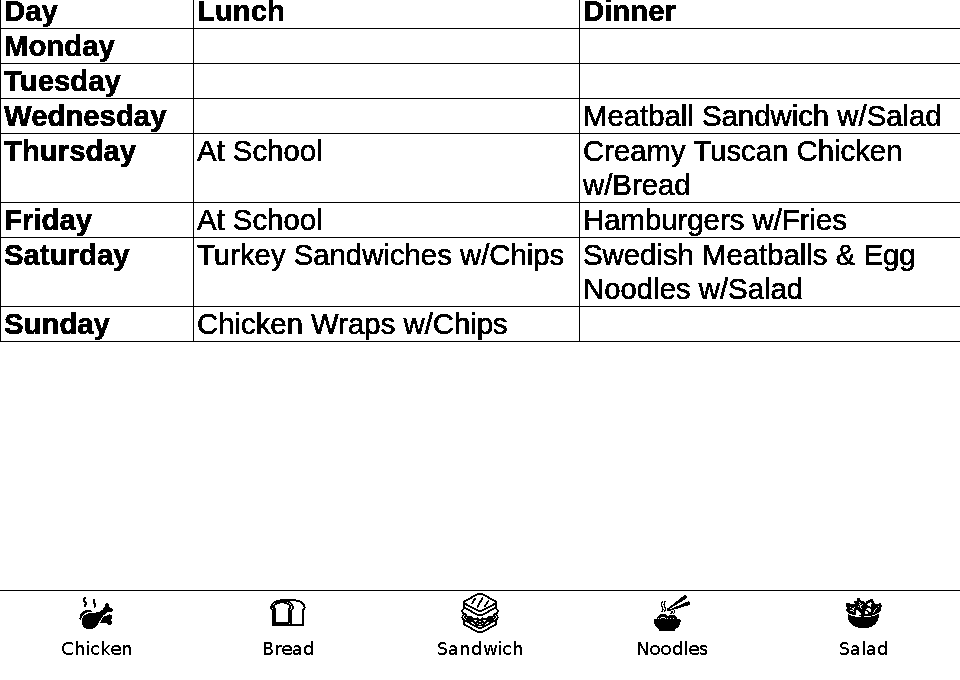
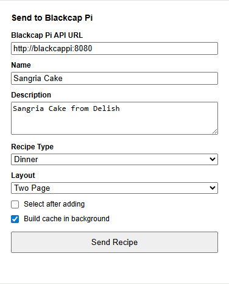
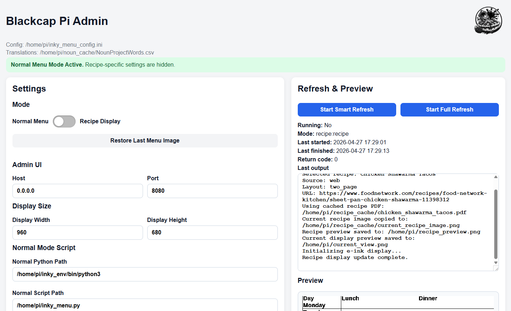
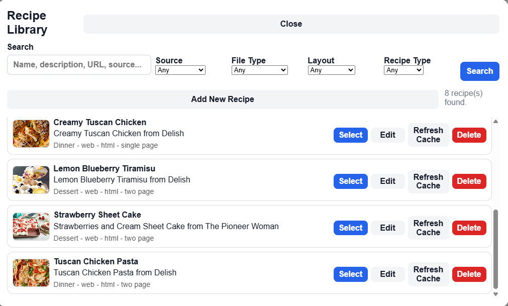
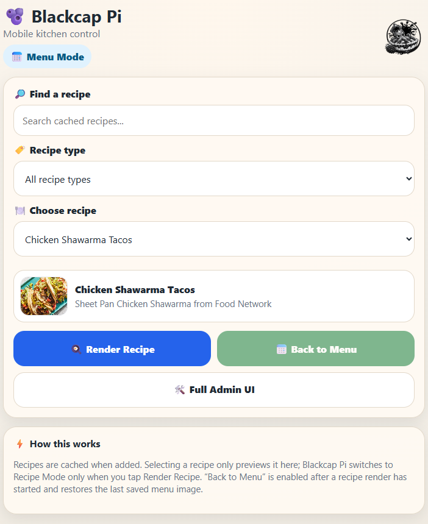

# 🫐 Blackcap Pi

A purpose-built Raspberry Pi + e-ink display system for beautifully simple, distraction-free content.

Blackcap Pi is designed to render **recipes** and **daily menus** in a clean, readable format—perfect for kitchens, family hubs, or anywhere you want useful information without screens screaming for attention.

---

## 📸 Preview

### 📅 Menu Mode with Smart Icons



*Automatically generated icons based on weekly menu content*

### 🌐 Chrome Extension (Send Recipe)



### 🛠 Admin UI



### 📚 Recipe Library



### 📱 Mobile Control



---

## ✨ Features

* 🖥️ Optimized for Waveshare e-ink displays
* 📅 Automated **Menu Mode** from a published Google Sheet
* 🍽️ Dedicated **Recipe Mode** (clean, readable layouts)
* 🌐 Chrome extension for one-click recipe capture
* ⚡ **Background recipe caching (default)**
* 🧠 Smart parsing (JSON-LD → fallback scraping → rendering)
* 🎨 Dynamic footer icons powered by OCR + Noun Project
* 🔄 Easy switching between modes
* 🛠️ Lightweight Admin UI (no bloat, just control)
* 📱 Mobile-friendly control interface (`/mobile`)

---

## 🧰 Tech Stack

* Python (Flask-based admin + services)
* Beautiful Soup (HTML parsing)
* Playwright (for stubborn JS-heavy sites)
* PIL / Pillow (image processing)
* Raspberry Pi (Zero 2 W works great)
* Waveshare 13.3" e-ink display

---

## 📦 Project Structure

```bash
Blackcap-Pi/
├── Blackcap-Pi-Extension/      # 🌐 Chrome extension
├── inky_admin/                 # 🛠 Admin UI
│   └── inky_admin_app.py
├── inky_menu.py                # 📅 Menu rendering logic
├── render_recipe_mode.py       # 🍽️ Recipe display renderer
├── inky_blackout.py            # 🧼 Monthly deep clean
├── inky_menu_config.ini        # ⚙️ Configuration
├── inky_env/                   # 🐍 Python virtual environment
└── README.md
```

---

## 🚀 Getting Started

### 1. Clone the Repo

git clone https://github.com/<your-repo>/Blackcap-Pi.git
cd Blackcap-Pi

---

### 2. 🐍 Create the Python Environment

/home/pi/inky_env

python3 -m venv /home/pi/inky_env
source /home/pi/inky_env/bin/activate
pip install -r requirements.txt

---

### 3. ⚙️ Configure

Edit:

inky_menu_config.ini

Set:

* Google Sheet URL
* Display settings
* OCR / icon settings

---

### 4. ▶️ Run Admin UI

/home/pi/inky_env/bin/python3 inky_admin/inky_admin_app.py

Open:

`http://<raspberry-pi-ip>:8080`

---

## 📅 Menu Mode

Menu Mode is the default behavior of Blackcap Pi.

You maintain a **Google Sheet**, publish it, and Blackcap Pi automatically renders it to the display.

---

### 🧾 How It Works

1. Update your weekly menu in Google Sheets
2. Publish the sheet to the web
3. Blackcap Pi pulls and renders it
4. OCR extracts keywords
5. Icons are generated and added to the footer
6. Display updates only if changes are detected

---

### 🧠 Smart Update Mode

The system avoids unnecessary refreshes:

* No change → no update
* Change detected → re-render + update

---

## 🎨 OCR + Noun Project Footer

After rendering the menu, Blackcap Pi enhances it with visual context using icons.

---

### 🧾 Example

From this menu:

```
Wednesday: Meatball Sandwich w/Salad
Saturday: Swedish Meatballs & Egg Noodles w/Salad
Sunday: Chicken Wraps w/Chips
```

Blackcap Pi extracts keywords like:

* chicken
* bread
* sandwich
* noodles
* salad

---

### 🧾 Example Configuration

```csv
chicken,chicken
bread,bread
sandwich,sandwich
noodles,noodles
salad,leaf
```

---

### ⚡ Behavior

* Icons are cached after first use
* Unknown words are skipped
* Common noise words are ignored
* Footer is rebuilt dynamically

---

## ⏰ Automation (Cron)

```cron
50 5 1 * * /home/pi/inky_env/bin/python3 /home/pi/inky_blackout.py
0 6 1 * * /home/pi/inky_env/bin/python3 /home/pi/inky_menu.py --full-refresh
30,40,50 6 * * * /home/pi/inky_env/bin/python3 /home/pi/inky_menu.py
*/10 7-21 * * * /home/pi/inky_env/bin/python3 /home/pi/inky_menu.py
0,10,20,30 22 * * * /home/pi/inky_env/bin/python3 /home/pi/inky_menu.py
```

---

## 🧼 Monthly Deep Clean

Runs black → white → reset cycle to reduce ghosting.

---

## 🔌 Chrome Extension (Recipe Capture)

Because copying recipes manually is a crime.

---

### 📦 Location

Blackcap-Pi-Extension/

---

### 🛠 Install (Developer Mode)

1. Go to:
   chrome://extensions/

2. Enable **Developer Mode**

3. Click **Load unpacked**

4. Select:
   Blackcap-Pi/Blackcap-Pi-Extension

---

### ⚙️ Configure

Click the extension and set:

`http://<raspberry-pi-ip>:8080`

---

## ⚡ How Recipe Capture Works

### 🧠 Smart Extraction

When you click the extension:

* **Name** → Page title
* **Description** → `<Recipe Title> from <Site Name>`
* **Source** → URL

---

### ⚡ Default Behavior: Background Caching

👉 This is important:

When you hit **Send to Blackcap Pi**:

* The recipe is fetched
* Parsed
* Images extracted
* Stored locally

🧊 **It does NOT immediately render to the display**

---

### 🎯 Why?

* Faster later rendering ⚡
* Works offline 📴
* Avoids re-scraping sites 🌐
* Keeps display transitions intentional

---

### 🖥️ To Show It

1. Open Admin UI
2. Select recipe
3. Click:
   **Render Recipe**

Boom. Kitchen-ready.

---

## 🔄 Display Modes

### 📅 Menu Mode (Default)

* Passive display
* Auto-updating
* Great for school menus / schedules

---

### 🍽️ Recipe Mode

* Clean, high-contrast recipe layout
* Built for actual cooking (not scrolling)

---

### 🔁 Switching Modes

In Admin UI:

* Select recipe → **Render Recipe**
* Exit → **Back to Menu**

---

## 🛠 Admin UI

`http://<raspberry-pi-ip>:8080`

From here you can:

* 📚 View cached recipes
* 🍽️ Render recipes
* 🔄 Switch modes
* ⚙️ Adjust settings
* 👀 Monitor system

---

## 📱 Mobile Control

Blackcap Pi includes a lightweight, mobile-friendly control interface — no app install required.

Access it at:

`http://<raspberry-pi-ip>:8080/mobile`

---

### ✨ Features

* 📱 Touch-friendly interface for phones and tablets
* 🔍 Search and filter recipes (including by type)
* 🖼️ Preview the image of a recipe before rendering the recipe
* 🍽️ One-tap **Render Recipe**
* 🔄 **Back to Menu** (restores last menu image)
* 🔗 Quick link back to full Admin UI

---

### ⚙️ How It Works

#### 🧭 Selecting a Recipe

* Selecting a recipe **does NOT change display mode**
* It only updates the preview (image + selection state)

#### 🍽️ Rendering a Recipe

* Tapping **Render Recipe**:

  * Switches the system into **Recipe Mode**
  * Sends the selected recipe to the display

#### 🔄 Returning to Menu

* **Back to Menu**:

  * Only enabled after a recipe has been rendered
  * Restores the **previous menu image**
  * Returns the display to **Menu Mode**

---

### 💡 Why This Design?

* Prevents accidental screen changes
* Keeps the display stable until intentional action
* Matches real-world kitchen usage (decide → then display)
* Makes mobile control feel fast and predictable

---

### 🧪 Pro Tip

Leave the recipe type filter blank to show **all recipes**, or narrow it down when you know what you’re looking for.

---

## 🧠 Parsing Strategy (Under the Hood)

Blackcap Pi tries multiple approaches:

1. JSON-LD (cleanest)
2. Beautiful Soup scraping
3. Playwright fallback (for JS-heavy sites)
4. Image extraction + caching

---

## 🖨 Hardware

* Raspberry Pi Zero 2 W
* Waveshare 13.3" e-ink
* Custom 3D-printed case (Instructables coming 👀)

---

## 🚧 Roadmap

* 🔐 Authentication
* ☁️ Secure remote access
* 🔄 Scheduled recipe rotation
* 🎨 Color display version (Blackcap Pi Spectrum?)

---

## 💡 Philosophy

Blackcap Pi is built to be:

* Calm
* Focused
* Useful
* Invisible when it should be

No notifications. No distractions. Just the right information at the right time.

---

## 🙌 Contributions

Ideas, tweaks, improvements — all welcome.
